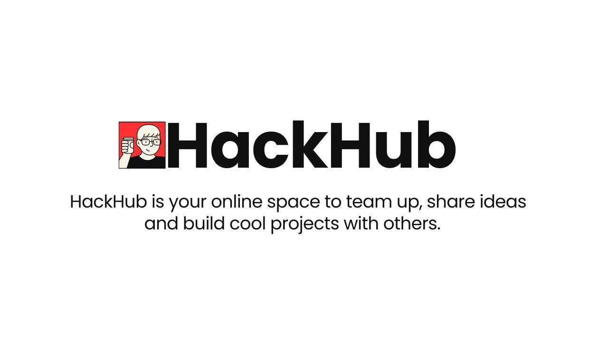

# Welcome to HackHub!

HackHub is your online space to team up, share ideas, and build cool projects with others.

### What's HackHub all about?

It's where you come to meet fellow coders, share your project ideas, and get feedback to make them even better. Whether you're a seasoned developer or just starting out, HackHub is the place to be for collaboration and inspiration.

## Features

- Real-Time Chatrooms
- Share Project Ideas
- Feedback
- User Profiles

## Screenshots

Here are some screenshots of HackHub:

    
    

    

## Built With 🛠

- Python
- Flask
- Flask-SocketIO
- MongoDB

## Getting Started

To get started with HackHub, follow these steps:

1. Clone this repository.
2. Install the required dependencies listed in `requirements.txt`.
3. Run the Flask application by executing `python app.py`.
4. Access the application in your web browser at `http://localhost:5000`.